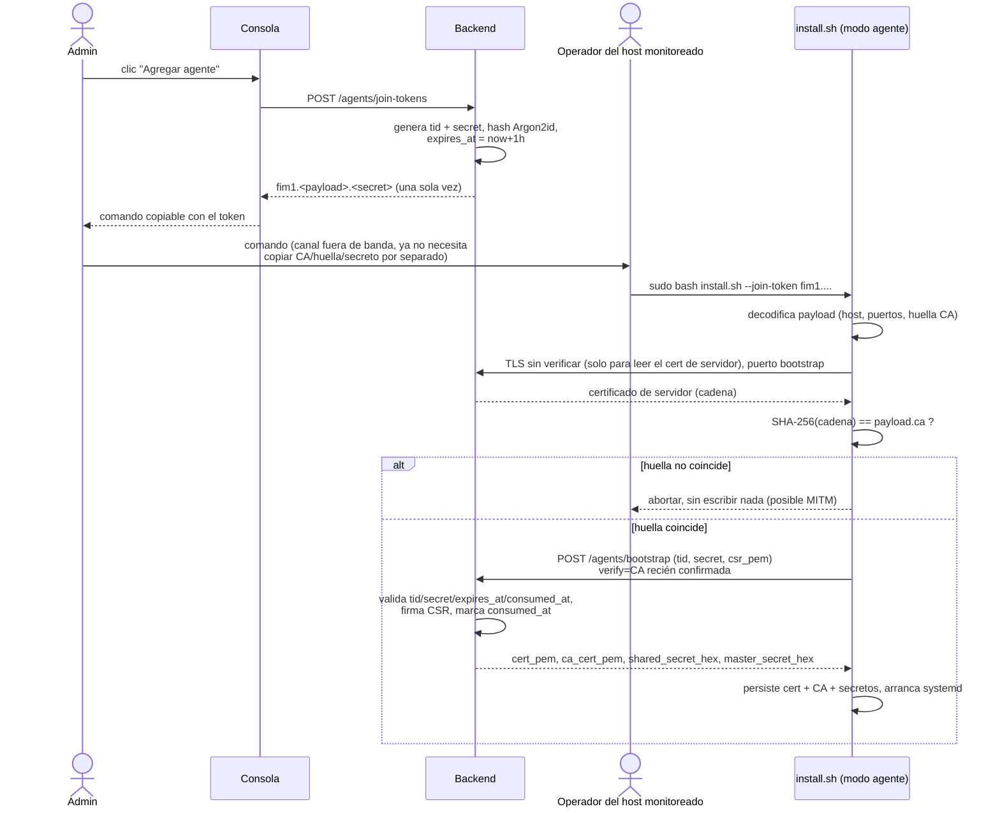

# Instalador unificado y token de unión — exploración

> Documento de exploración (sin implementación). No es documentación canónica del
> proyecto (no vive bajo `docs/arquitectura_stack.md`, `docs/reglas_de_negocio.md`
> ni `openspec/`) — es un insumo para decidir si esta idea se convierte en un
> change de OPSX después de que `vps-deployment-readiness` se archive.

## 1. Objetivo y alcance

### Objetivo

Explorar cómo construir una experiencia de instalación única (`install.sh` con
selector de modo) que elimine el ida-y-vuelta manual entre el host servidor y el
host monitoreado que hoy exige el despliegue multi-host: copiar `fim-ca.pem` a
mano, tipear un secreto de bootstrap, y ejecutar tres herramientas separadas
(`scripts/prepare_server_env.py`, `docker compose up`, `scripts/register-agent.sh`)
sin que ninguna las coordine.

Se investigan tres modos de instalación (servidor; servidor+agente en el mismo
equipo; agente para un host monitoreado), el conjunto mínimo de preguntas de
primer arranque, la parametrización de puertos, los modos de HTTPS de la consola
(incluyendo URL personalizada y sub-path), y un **token de unión** que reemplace
la copia manual de CA + huella + secreto por un único valor copiable.

Se agrega además el **ciclo de vida completo** (instalación, reinstalación o
reparación, actualización y desinstalación) y dónde se administran las
configuraciones globales una vez terminado el primer inicio (§4.11).

### Fuera de alcance

- Alta disponibilidad, más de una réplica del backend (RN-76) o rotación de la
  CA — sin cambios respecto de lo que ya fija `vps-deployment-readiness`.
- Automatizar la emisión Let's Encrypt/ACME dentro del instalador es **evaluado**
  (§4.4) pero la decisión de implementarlo queda para el change que se abra a
  partir de esta exploración, no para este documento.
- Los hallazgos abiertos de A-3 ajenos a la instalación (ruido del stream
  `commands`, `FAN_MARK_FILESYSTEM`, `process_exe` vacío, tipo de evento de
  archivo nuevo) — no son parte de esta exploración.
- Cualquier edición de código, specs, `CHANGES.md` o los docs canónicos. Este
  documento no toca `openspec/changes/vps-deployment-readiness/**`, que otra
  sesión está implementando en paralelo (64–68/78 tareas al momento de esta
  lectura).

## 2. Estado actual (verificado)

Todo lo que sigue se leyó del código y la documentación del repositorio en su
estado actual (rama `devel`). Cada afirmación cita `archivo:línea`.

### 2.1 Flujo de instalación del servidor, paso a paso

1. **Generar `.env`** con `scripts/prepare_server_env.py`. El script:
   - pregunta o recibe por flag `--fim-public-hosts`, `--console-tls-mode`,
     `--console-http-port`/`--console-https-port` (defaults `80`/`443`,
     `scripts/prepare_server_env.py:287-288`), `--admin-username` y los tres
     datos del owner de n8n (`scripts/prepare_server_env.py:292-295`);
   - genera automáticamente `DB_PASSWORD`, `JWT_SECRET_CURRENT`,
     `ADMIN_PASSWORD`, `N8N_ENCRYPTION_KEY` y el hash bcrypt del owner de n8n
     (`scripts/prepare_server_env.py:340-364`);
   - **no pregunta nada de SMTP** — las seis variables `SMTP_*` se escriben
     vacías o con su default (`scripts/prepare_server_env.py:370-377`), sin
     prompt interactivo ni acción de "enviar prueba";
   - deriva `CORS_ALLOWED_ORIGINS` de `FIM_PUBLIC_HOSTS` (D59/RN-153,
     `scripts/prepare_server_env.py:157-179`);
   - se niega a sobreescribir un `.env` existente, con `O_CREAT|O_EXCL`
     (`scripts/prepare_server_env.py:251-263`).
2. **Levantar el stack**: `docker compose -f docker-compose.yml -f
   docker-compose.tls.yml --profile app up -d --build`
   (`docs/despliegue_servidor_remoto.md:107`). Nada de esto pide más datos —
   ya están en `.env`.
3. **Restringir acceso a los puertos publicados a mano**, con seis comandos
   `iptables -I DOCKER-USER ...` copiados literalmente de la guía
   (`docs/despliegue_servidor_remoto.md:136-145`) — el instalador no genera ni
   aplica estas reglas.
4. **Registrar el agente**: `scripts/register-agent.sh <agent_id>`, que
   ejecuta dentro del contenedor `backend` ya corriendo
   `python -m app.modules.agents.cli register --agent-id <id>`
   (`scripts/register-agent.sh:25-26`) y copia la CA fuera del contenedor con
   `docker compose cp backend:/certs/ca.pem ./fim-ca.pem`
   (`scripts/register-agent.sh:30`). El operador debe tener acceso Docker al
   servidor para este paso (`scripts/register-agent.sh:8-9`; `backend/app/modules/agents/cli.py:14-17`).
5. **Copiar a mano, por un canal que el operador considere seguro**:
   `fim-ca.pem`, la huella SHA-256 de la CA y el secreto de bootstrap
   (`docs/despliegue_servidor_remoto.md:173-175`). Ninguno de los tres viaja
   junto en un solo valor.

### 2.2 Flujo de instalación del agente, paso a paso

1. `sudo bash agent/install.sh --non-interactive --server-host <host> \
   --agent-id <id> --watch-path <path> --ca-cert ./fim-ca.pem \
   --ca-fingerprint <huella> --bootstrap-secret-file <archivo>`
   (`docs/despliegue_servidor_remoto.md:183-190`). Los tres valores del paso
   anterior (`fim-ca.pem`, huella, secreto) deben haber llegado por separado.
2. `install.sh` valida la versión de Python, crea el venv, hace staging del
   código, y ejecuta tres subcomandos puros de `agent/installer.py`: `plan`
   (valida sin escribir, `agent/install.sh:204`), `apply` (escribe
   `config.yaml`, `ca.pem` y `env`, `agent/install.sh:228`) y `check` (verifica
   alcance TCP/TLS a 8444 y 6380, `agent/install.sh:258`).
3. `installer.py` deriva `backend_url`, `mtls_backend_url` y `valkey_url` a
   partir de un único `--server-host`, con los tres puertos **hardcodeados**:

   ```
   agent/installer.py:149-157
   def derive_urls(host: str) -> tuple[str, str, str]:
       ...
       return (
           f"https://{bracketed}:8444",
           f"https://{bracketed}:8443",
           f"valkeys://{bracketed}:6380",
       )
   ```

   No hay flag ni variable de entorno para cambiar 8443/8444/6380 del lado del
   agente.
4. `load_and_verify_ca` (`agent/installer.py:250-276`) exige que
   `--ca-cert` ya apunte a un archivo local con el PEM de la CA — el
   instalador **no lo descubre ni lo descarga**; el archivo tiene que haber
   llegado por otro medio (paso 2.1.5).
5. El secreto de bootstrap se acepta solo por prompt oculto o archivo, nunca
   por flag ni variable de entorno (`agent/installer.py:160-186`,
   `agent/installer.py:223-232` rechaza explícitamente `--bootstrap-secret`).
6. `agent/bootstrap.py:137-148` rechaza cualquier `backend_url` que no sea
   `https` antes de abrir conexión (D52/RN-146, RN-114); `agent/bootstrap.py:150-161`
   exige que `ca_cert_path` ya exista en disco (D16/RN-114) — de nuevo, la CA
   debe estar pre-provista, no se descubre en el propio bootstrap.
7. El bootstrap (`agent/bootstrap.py:170-208`) hace `POST /agents/bootstrap`
   contra el puerto 8444 con `verify=str(ca_cert_path)`, recibe cert propio +
   `ca_cert_pem` (redundante con el paso 4) + `shared_secret_hex` +
   `master_secret_hex`, y los persiste.

### 2.3 Qué puertos están parametrizados y cuáles no

| Puerto | Servicio | ¿Parametrizado? | Evidencia |
|---|---|---|---|
| 80 / 443 (consola) | frontend | **Sí** — `CONSOLE_HTTP_PORT`/`CONSOLE_HTTPS_PORT`, default 80/443 | `docker-compose.yml:319-320` (`"${CONSOLE_HTTP_PORT:-80}:80"`, `"${CONSOLE_HTTPS_PORT:-443}:443"`) |
| 8443 (mTLS renovación) | backend | **No** — fijo en el compose y en el default de la función que arranca el listener | `docker-compose.yml:295` (`"8443:8443"`); `backend/app/core/pki.py:644` (`port: int = 8443`); `backend/app/main.py:85-90` no pasa `port=` |
| 8444 (bootstrap) | backend | **No** | `docker-compose.yml:296` (`"8444:8444"`); `backend/app/core/pki.py:698` (`port: int = 8444`); `backend/app/main.py:91-95` no pasa `port=` |
| 6380 (Valkey TLS) | valkey | **No** — fijo en el override, y en el comando de arranque de Valkey | `docker-compose.tls.yml:51` (`"6380:6380"`); `docker-compose.tls.yml:54-59` (`--tls-port 6380` literal) |
| 8000 (API HTTP plana) | backend | Publicado solo en loopback, sin variable | `docker-compose.yml:297` (`"127.0.0.1:8000:8000"`) |
| 5432/6379/5678 (internos) | db/valkey/n8n | No publicados, ninguno debe pedirse al operador (D54/RN-148) | `docker-compose.yml` (sin bloque `ports:` en `db`, `valkey` base, `n8n`) |

En el agente, los tres puertos de servidor (8443/8444/6380) están
**hardcodeados en `derive_urls`** (`agent/installer.py:149-157`) y en la tabla
de verificación de alcance `SCOPE_CHECK_PORTS = ((8444, False), (6380, True))`
(`agent/installer.py:58-61`) — ningún flag los cambia.

### 2.4 Cómo viajan hoy la CA y el secreto de bootstrap

- **CA**: el backend la genera (si falta) en `certs-init`
  (`backend/app/core/certs_init.py:93-99`, que llama a
  `ensure_ca` de `backend/app/core/pki.py:199-274`) y queda en el volumen
  `backend_certs`. El operador la saca del contenedor a mano con `docker
  compose cp` (`scripts/register-agent.sh:30`) y la mueve al host monitoreado
  como archivo (`fim-ca.pem`). El agente **no la descubre por red**: la
  recibe dos veces — una vez como archivo local pre-provisto que verifica por
  huella (`agent/installer.py:250-276`) y otra vez dentro de la respuesta de
  bootstrap (`ca_cert_pem` en `backend/app/modules/agents/models.py:76-79`),
  que solo usa para persistirla junto al cert propio
  (`agent/bootstrap.py:205-208`) — no para descubrimiento inicial.
- **Secreto de bootstrap**: se genera en el servidor con
  `secrets.token_hex(16)` (`backend/app/modules/agents/cli.py:40,59`), se
  guarda con hash Argon2id en `Agent.bootstrap_secret_hash`
  (`backend/app/modules/agents/service.py:41-46`,
  `backend/app/modules/agents/models.py:28`), y se imprime **una sola vez** en
  la terminal del servidor (`backend/app/modules/agents/cli.py:78`). Es
  **de un solo uso**: `bootstrap_agent` lo pone en `None` tras el primer
  bootstrap exitoso (`backend/app/modules/agents/service.py:80`) — verificado
  en código, confirma lo que pide el enunciado del usuario. **No tiene TTL**:
  `Agent` no tiene columna de expiración
  (`backend/app/modules/agents/models.py:20-44`) — un registro sin bootstrapear
  queda válido indefinidamente hasta que alguien lo use o lo borre a mano.
  Tampoco hay endpoint ni columna para **revocar** un secreto sin consumirlo.
- El secreto viaja del operador del servidor al operador del host monitoreado
  "por un canal que considere seguro" — texto literal de
  `docs/despliegue_servidor_remoto.md:173-175`. No hay mecanismo del producto
  para ese transporte.

### 2.5 Modos TLS de la consola, hoy

`CONSOLE_TLS_MODE` acepta `off | self_signed | provided`
(`backend/app/core/config.py:64`), aplicado por
`frontend/docker-entrypoint.d/40-fim-console-tls.sh:48-83`, que instala una de
dos plantillas nginx (`frontend/nginx/console-http.conf`,
`frontend/nginx/console-https.conf`) según el modo. En `provided`, el operador
monta un directorio completo (para soportar el patrón `live/ → archive/` de
Let's Encrypt) en `CONSOLE_TLS_DIR` con `CONSOLE_TLS_CERT_FILE`/`CONSOLE_TLS_KEY_FILE`
(`docker-compose.yml:326-328`; `docs/despliegue_servidor_remoto.md:92-97`) — el
certificado en sí **lo obtiene el operador por su cuenta**; no hay automatización
ACME/Let's Encrypt en el producto
(`openspec/changes/vps-deployment-readiness/design.md:28`, Non-Goal explícito:
*"Emisión automática con Let's Encrypt/ACME: el modo `provided` consume un
certificado que el operador obtiene por su cuenta"*).

No existe soporte de sub-path: `frontend/vite.config.ts:1-27` no define `base`,
y las tres plantillas nginx (`frontend/nginx/console-http.conf`,
`console-https.conf`, `frontend/nginx/common-locations.conf:32-34`) sirven la
SPA en `location /` — una consola en `/fim` no está contemplada hoy.

### 2.6 Consola / UI de agentes, hoy

`frontend/src/pages/Agents.tsx` (141 líneas) solo lista agentes, permite
reconfigurar `watch_paths` y disparar un rescan (`useAgents`,
`useUpdateAgentConfig`, `useRescanAgent`) — no hay ningún botón ni llamada de
registro/alta de agente en ese archivo. El único camino para registrar un
agente hoy es la CLI del servidor (§2.1.4) o `POST /agents/register`, protegido
por `require_admin` (`backend/app/modules/agents/router.py:107-114`) pero que
exige que el **cliente** (la propia consola, si la llamara) ya conozca un
`bootstrap_secret` de al menos 16 caracteres
(`backend/app/modules/agents/models.py:57-66`) — nadie en el frontend lo
genera ni lo muestra.

### 2.7 Hallazgos del ensayo A-3 (dolor manual observado)

`tesis/cierre/evidencia/v10-closure-20260912T190052Z/a3-multihost/README.md`
documenta, entre los hallazgos **ya corregidos** por D52/RN-146 y D53/RN-147
(bootstrap sin TLS, SAN fijo en código), y entre los **abiertos, no
corregidos**: reinstalar el agente anidaba el código (`install.sh` actual ya
lo resuelve — ver comentario en `agent/install.sh:26-29`, staging +
`mv`/`rm -rf` en vez de `cp -r` sobre el destino), ruido del stream `commands`
compartido al primer arranque, ruido de `FAN_MARK_FILESYSTEM`, el listener 8443
no emite alerta TLS legible al rechazar, `file_created` mal clasificado,
`diff_text` vacío en creaciones, `process_exe` vacío, y la nota de proceso de
que el registro del agente se hizo "con un script ad hoc guardado en la carpeta
de evidencia" (`registrar_agente_a3.sh`) — exactamente el patrón que D56/RN-150
productizó como `scripts/register-agent.sh`, pero que sigue siendo un script
de terminal, no un token copiable de un solo valor.

## 3. Brechas

| # | Brecha | Estado actual (evidencia) | Objetivo pedido |
|---|---|---|---|
| G1 | Puertos 8443/8444/6380 no parametrizables | Hardcodeados en `docker-compose.yml:295-296`, `docker-compose.tls.yml:51,54-59`, `backend/app/core/pki.py:644,698`, `agent/installer.py:149-157,58-61` | Puertos con default configurable, propagados a compose, installer, CORS/SAN y token |
| G2 | No hay selector de modo (servidor / servidor+agente / agente) | `agent/install.sh` solo instala el agente; el servidor se prepara con 3 herramientas separadas sin punto de entrada único (`scripts/prepare_server_env.py`, `docker compose up`, `scripts/register-agent.sh`) | Un `install.sh` con 3 modos elegidos al inicio |
| G3 | La CA viaja como archivo copiado a mano, no por huella de descubrimiento | `scripts/register-agent.sh:29-30` (`docker compose cp`); `agent/installer.py:250-276` exige el archivo ya presente | Patrón `--discovery-token-ca-cert-hash` (fetch + verificación de huella, sin copiar el archivo) |
| G4 | Sin TTL ni revocación del secreto de bootstrap | `Agent` sin columna de expiración (`backend/app/modules/agents/models.py:20-44`); sin endpoint de revocación | Token con expiración y revocación desde la consola |
| G5 | Alta de agente solo por CLI con acceso Docker al servidor | `scripts/register-agent.sh:8-9`; nada en `frontend/src/pages/Agents.tsx` | Botón "Agregar agente" en la consola (RBAC admin) |
| G6 | Tres valores (host+puertos, huella CA, secreto) viajan por separado | `docs/despliegue_servidor_remoto.md:173-175` ("por un canal que considere seguro") | Un solo valor copiable (token) |
| G7 | SMTP sin prompt de primer arranque ni acción de prueba | `scripts/prepare_server_env.py:370-377` (vacío, sin prompt) | Prompt opcional + acción "enviar prueba" |
| G8 | Sin sub-path de consola | `frontend/vite.config.ts` sin `base`; nginx sirve en `location /` | Consola operable en `/fim` |
| G9 | Sin automatización Let's Encrypt | Non-Goal explícito de `vps-deployment-readiness` (`design.md:28`); modo `provided` requiere certificado ya emitido | A evaluar (HTTP-01 vs DNS-01 vs mantener manual) |
| G10 | No existe página web de configuración | No hay código de un setup web en el repo (búsqueda sin resultados) | A evaluar como opcional, terminal-first |
| G11 | Reglas de firewall manuales | Seis comandos `iptables -I DOCKER-USER` copiados a mano (`docs/despliegue_servidor_remoto.md:136-145`) | Resumen de firewall generado por el instalador (no necesariamente aplicado automáticamente) |
| G12 | No existe desinstalación | Sin script, subcomando ni flag de desinstalación en `agent/install.sh`, `agent/installer.py` ni en la documentación de despliegue (búsqueda sin resultados) | `install.sh uninstall` para agente y servidor, con `--keep-data` o `--purge` |
| G13 | No existe baja de agente en el servidor | `backend/app/modules/agents/router.py` sólo expone `POST /agents/register`, `/config` y `/rescan` (`:107`, `:153`, `:171`); `AgentStatus` no tiene un estado de baja (`models.py:24`) | Estado `decommissioned`, baja desde la consola y desde el desinstalador |
| G14 | La revocación de certificados no tiene escritor | La tabla `revoked_certificates` existe (`models.py:47`) y se consulta en 8443 (`core/pki.py:612`, `agents/router.py:85`), pero ningún código de `backend/app` crea filas `RevokedCertificate` | Revocar el certificado del agente en toda baja |
| G15 | Actualización del servidor sin respaldo previo | No hay `pg_dump` ni respaldo de la CA en `scripts/` ni en la guía de despliegue (búsqueda sin resultados) | Respaldo automático antes de migrar y restauración ante fallo |
| G16 | Configuración global sólo por variables de entorno | SMTP y n8n se leen de `settings` (`backend/app/core/config.py:91-122`); cambiarlos exige reiniciar el backend | Sección «Configuración» en la consola para valores modificables en caliente |

## 4. Diseño propuesto

Todo lo que sigue es **propuesta**, no estado verificado.

### 4.1 Instalador y modos

Un único `install.sh` en la raíz del repo (distinto del actual
`agent/install.sh`, que se mantiene como el paso final del modo "agente") que
abre con un selector:

```
1) Servidor           (backend, consola, PostgreSQL, Valkey, n8n)
2) Servidor + agente   (todo lo anterior + agente en este mismo equipo)
3) Agente               (para un host monitoreado remoto)
```

- Modo 1 y 2 delegan en un nuevo `scripts/install_server.py` que envuelve, en
  orden, `prepare_server_env.py` (o su reemplazo, ver 4.2), `docker compose ...
  up -d --build`, un healthcheck que sondea `/health/components`, y —solo en
  modo 2— una llamada in-proceso al flujo de "acuñar token" (4.5) seguida de
  invocar el `install.sh` de agente actual contra `localhost`.
- Modo 3 es el `agent/install.sh` actual, extendido para aceptar
  `--join-token` (4.5) como alternativa a `--server-host` +
  `--ca-cert`/`--ca-fingerprint`/`--bootstrap-secret-file` explícitos — estos
  últimos se conservan para compatibilidad con automatización existente
  (Ansible, etc.) y con `docs/despliegue_servidor_remoto.md` tal como está.
- Ninguno de los tres modos reemplaza `docker-compose.yml` +
  `docker-compose.tls.yml`: siguen siendo la fuente de verdad de la topología
  (D54/RN-148); el instalador solo genera `.env` y orquesta los comandos.

### 4.2 Preguntas del primer inicio y valores generados

| Pregunta | Modo | Generado automáticamente |
|---|---|---|
| Usuario admin, contraseña, email | Servidor | — (las tres se piden; hoy solo `admin_username` se pregunta y `ADMIN_PASSWORD` se genera — `scripts/prepare_server_env.py:320,325` — se propone pedir también la contraseña, con confirmación, y el email, hoy fijo en `admin@fim.local`, `backend/app/core/config.py:37`) |
| Dominio o IP pública | Servidor | — |
| Puertos expuestos (consola, 8443/8444/6380) | Servidor | Defaults 80/443/8443/8444/6380, con validación de rango y de colisión entre sí |
| Modo HTTPS de la consola | Servidor | — (`off`/`self_signed`/`provided`/`letsencrypt` propuesto, 4.4) |
| SMTP opcional + destinatarios + "enviar prueba" | Servidor | Vacío si se omite (comportamiento actual preservado) |
| — | — | `DB_PASSWORD`, `JWT_SECRET_CURRENT`, CA + todos los certificados, `N8N_ENCRYPTION_KEY`, owner de n8n — igual que hoy, nunca preguntados |
| Rutas a monitorear (watch paths) | Agente | — |
| Token de unión | Agente | — (reemplaza host + CA + huella + secreto) |

Explícitamente **no** se preguntan en el primer arranque (quedan para
configuración avanzada posterior, vía `.env` o la consola): rate limits
(`RATE_LIMIT_*`, `backend/app/core/config.py:71-84`), canales de n8n
(`N8N_FIM_CHANNELS` y sus credenciales por canal, D58/RN-152), ni ningún
secreto interno.

### 4.3 Puertos — parametrización y propagación

Se introducen tres variables nuevas de `.env`, con los defaults actuales:
`AGENT_MTLS_PORT=8443`, `AGENT_BOOTSTRAP_PORT=8444`, `VALKEY_TLS_PORT=6380`.
Cadena de propagación necesaria (todos son cambios de código, no solo de
`.env.example`):

1. `docker-compose.yml` / `docker-compose.tls.yml`: los mapeos `"8443:8443"`
   (`docker-compose.yml:295`), `"8444:8444"` (`:296`) y `"6380:6380"`
   (`docker-compose.tls.yml:51`) pasan a `"${AGENT_MTLS_PORT:-8443}:${AGENT_MTLS_PORT:-8443}"`
   y análogos — el contenedor escucha en el mismo puerto interno que expone,
   igual que hace hoy la consola con `CONSOLE_HTTP_PORT`/`CONSOLE_HTTPS_PORT`
   (`docker-compose.yml:319-320`).
2. `backend/app/core/config.py`: nuevos campos `Settings.agent_mtls_port: int
   = 8443` y `agent_bootstrap_port: int = 8444`.
3. `backend/app/core/pki.py:638-645,693-699`: `start_mtls_server`/
   `start_bootstrap_server` reciben `port=settings.agent_mtls_port` /
   `settings.agent_bootstrap_port` desde `backend/app/main.py:85-95` en vez
   del default fijo.
4. `docker-compose.tls.yml`: `--tls-port ${VALKEY_TLS_PORT:-6380}` en el
   comando de Valkey (hoy literal, `docker-compose.tls.yml:55`), y el
   `VALKEY_URL` del backend (`docker-compose.tls.yml:81-82`) apunta a
   `valkeys://valkey:${VALKEY_TLS_PORT:-6380}`.
5. `agent/installer.py`: `derive_urls` (hoy `agent/installer.py:149-157`) deja
   de hardcodear los tres puertos — los recibe como parámetros con esos mismos
   defaults, resueltos por flag/env igual que `--server-host`; `SCOPE_CHECK_PORTS`
   (`agent/installer.py:58-61`) pasa a construirse a partir de esos mismos
   valores.
6. El token de unión (4.5) lleva los tres puertos resueltos, así que un agente
   que se instala vía token nunca necesita conocer los defaults — solo un
   `install.sh --server-host ... --agent-mtls-port ...` manual (compatibilidad)
   los necesita explícitos.
7. `CORS_ALLOWED_ORIGINS` no cambia: solo depende de los puertos de la
   consola (D59/RN-153, `scripts/prepare_server_env.py:157-179`), que ya están
   parametrizados — los tres puertos de agente no son orígenes CORS.
8. **Resumen de firewall**: al final de la instalación de servidor, el
   instalador imprime (no ejecuta) los mismos comandos `iptables -I
   DOCKER-USER` que hoy están en la guía
   (`docs/despliegue_servidor_remoto.md:136-145`), ya con los puertos elegidos
   sustituidos — cierra G11 sin asumir el riesgo de tocar el firewall del host
   automáticamente.

### 4.4 URL de la consola y HTTPS

**Qué funciona hoy sin cambios**: una consola en `https://<host>:<puerto-no-estándar>`
(ej. `:4533`) ya es alcanzable con `CONSOLE_HTTPS_PORT=4533` — el mapeo de
puerto de Compose no tiene relación con el certificado ni con `FIM_PUBLIC_HOSTS`.
`CORS_ALLOWED_ORIGINS` sí necesita incluir ese puerto: la derivación actual
(`scripts/prepare_server_env.py:157-179`) ya agrega el puerto cuando no es el
default del esquema, así que un puerto no estándar **ya está cubierto** por
D59/RN-153 sin cambios.

**Prerrequisito de DNS, fuera del control del instalador**: para
`sistema-fim-tesis.com.ar` el operador tiene que crear el registro `A`/`AAAA`
apuntando a la IP del servidor en su proveedor de DNS **antes** de pedir un
certificado público — el instalador no puede automatizar esto (no es dueño de
la zona DNS). Se propone que el instalador lo señale explícitamente como paso
manual previo, con una verificación de resolución (`socket.getaddrinfo`,
patrón ya usado en `agent/installer.py:516`) antes de intentar HTTP-01.

**Let's Encrypt con puerto no estándar — restricción real, no producto**:
HTTP-01 exige que el desafío sea alcanzable en el puerto 80 exacto
(`http://<dominio>/.well-known/acme-challenge/...`) — la CA de Let's Encrypt
no sigue redirecciones a otro puerto. Un `CONSOLE_HTTPS_PORT` distinto de 443
**no rompe** HTTP-01 (el desafío es independiente del puerto donde después se
sirve HTTPS), pero si el operador **tampoco** puede exponer el 80 (por ejemplo,
otro servicio ya lo usa en ese host), la única vía es DNS-01, que exige que el
instalador tenga credenciales de API del proveedor DNS — una superficie de
configuración que hoy no existe en el producto y que D54/RN-148 no contempla.
Se propone limitar la automatización de Let's Encrypt a HTTP-01 (requiere 80
libre en el host, aunque la consola después escuche en otro puerto) y dejar
DNS-01 fuera de alcance, documentado como limitación, no como bug.

**Sub-path (`/fim`)**: hoy no soportado (§2.5). Para soportarlo:
- `frontend/vite.config.ts` necesita `base: process.env.VITE_BASE_PATH ??
  '/'` y todas las rutas de React Router deben montarse bajo ese `basename`.
- Las tres plantillas nginx (`console-http.conf`, `console-https.conf`,
  `common-locations.conf`) necesitan un bloque `location /fim/` que reescriba
  hacia el root de los assets, y el SPA-fallback (`common-locations.conf:32-34`)
  debe servir `index.html` bajo ese prefijo, no en `/`.
- El proxy hacia `/api/` (`common-locations.conf:16-24`) y el
  `location = /auth/refresh` (`common-locations.conf:6-14`) — atado a
  `Path=/auth/refresh` de la cookie de refresh — necesitan decidir si viven
  bajo el mismo prefijo o quedan en la raíz; moverlos rompería la cookie
  existente si no se coordina con el cambio de path de la cookie. **Esto es un
  cambio con superficie no trivial**, no una bandera de una línea — se
  documenta como parte de la propuesta pero se recomienda tratarlo como una
  entrega separada dentro del work package de consola (§9), no como parte del
  MVP del instalador.

Modos de consola propuestos: `off | self_signed | provided | letsencrypt`
(el cuarto es nuevo). `letsencrypt` reusa el layout de directorio que
`provided` ya soporta (`live/ → archive/`, `docker-compose.yml:326-328`) — el
instalador correría un contenedor sidecar de certbot (§5) que escribe ahí y
delega en el `docker compose restart frontend` que la guía actual ya documenta
para renovaciones (`docs/despliegue_servidor_remoto.md:240-247`).

### 4.5 Token de unión

**Formato propuesto**: `fim1.<payload>.<secret>`, donde:

- `fim1` es el prefijo de versión (permite invalidar el formato completo si
  cambia sin ambigüedad, mismo patrón que `ghp_`/`sk-` de otros productos).
- `<payload>` es JSON compacto en base64url, **sin firmar** (no hace falta:
  el secreto que lo acompaña ya prueba autenticidad ante el servidor, y el
  payload solo transporta datos de descubrimiento, no autorización):
  ```json
  {"h": "<host o IP>", "mp": 8443, "bp": 8444, "vp": 6380,
   "ca": "<sha256 hex de la CA>", "tid": "<id opaco de 8 chars>"}
  ```
- `<secret>` es el secreto de un solo uso en claro, 32 bytes en base64url —
  **nunca** se persiste en claro en el servidor, solo su hash (mismo patrón
  Argon2id que ya usa `bootstrap_secret_hash`,
  `backend/app/modules/agents/service.py:41`).

Esto es deliberadamente un **híbrido** entre las dos alternativas puras
discutidas en §5: la parte de descubrimiento (`host`, puertos, huella de CA)
es **autocontenida** — el agente no necesita ninguna llamada previa al
servidor para saber a dónde conectarse y qué CA esperar, cerrando G3 y G6 sin
depender de que el operador copie `fim-ca.pem` a mano. La parte de
autorización (`tid` + `secret`) es **opaca con lookup en el servidor** — igual
que hoy, el servidor solo guarda un hash, puede expirarlo y puede revocarlo
sin tener que invalidar criptografía. `tid` reemplaza a `agent_id` como clave
de búsqueda de la fila pendiente (hoy el registro usa `agent_id` como PK
directamente, `backend/app/modules/agents/models.py:23` — el token deja
`agent_id` para que lo declare el propio agente en el bootstrap, como hoy).

**Modelo de datos** — se propone una tabla nueva `agent_join_tokens`
(no una migración sobre `agents`, para no acoplar el ciclo de vida del token
al de la fila `Agent` que ya existe):

| Columna | Tipo | Nota |
|---|---|---|
| `token_id` | `str`, PK | el `tid` del payload, 8 caracteres, generado con `secrets.token_hex` |
| `secret_hash` | `str` | Argon2id, igual patrón que `bootstrap_secret_hash` |
| `created_by_user_id` | `int`, FK `users.id` | quién lo acuñó (admin de consola o `register-agent.sh`) |
| `created_at` | `datetime` (TZ-aware, patrón `_TZ_AWARE` de `backend/app/modules/agents/models.py:9`) | |
| `expires_at` | `datetime` | default `created_at + 1h`, configurable |
| `consumed_at` | `datetime \| None` | se fija en el primer bootstrap exitoso — nunca se reutiliza tras esto |
| `revoked_at` | `datetime \| None` | fijado por un admin desde la consola antes de su consumo |
| `agent_id_hint` | `str \| None` | opcional, si el admin ya eligió un `agent_id` al acuñar |

**TTL y de un solo uso**: `bootstrap_agent` (hoy
`backend/app/modules/agents/service.py:53-89`) pasa a validar, antes que
nada: `revoked_at is None`, `consumed_at is None`, `now < expires_at`. Cualquier
falla es 401 (mismo código que hoy usa para secreto inválido,
`backend/app/modules/agents/service.py:64,69`) — no se distingue por
respuesta HTTP entre "vencido"/"revocado"/"reusado" para no dar información a
un atacante que intenta adivinar, aunque sí se loguea la causa específica en
`audit_log` para el admin.

**Modelo de amenaza**:

| Amenaza | Mitigación |
|---|---|
| Fuga del token (copiado a un chat, historial de shell) | TTL corto (1h default) + un solo uso; revocación manual desde la consola antes de que se use |
| MITM en el canal por el que se copia el token | El propio token lleva la huella de la CA — un MITM no puede sustituir la CA sin que el agente detecte el mismatch antes de confiar en nada (mismo principio que `--discovery-token-ca-cert-hash` de kubeadm) |
| Repetición (replay) del secreto ya consumido | `consumed_at` se fija atómicamente en la misma transacción que emite el certificado — un segundo intento con el mismo secreto encuentra `consumed_at is not None` y falla |
| Token expirado usado igual | Chequeo de `expires_at` antes de tocar `secret_hash` — un token vencido no revela si el secreto era correcto |
| Fuerza bruta contra `tid` o `secret` | `tid` es de búsqueda, no de autorización — no protege nada por sí solo; `secret` de 32 bytes aleatorios hace la búsqueda por fuerza bruta inviable dentro del TTL |
| Admin comprometido acuña tokens de más | Cada acuñación queda en `audit_log` con `created_by_user_id`, igual patrón que `update_agent_config`/`rescan_agent` (`backend/app/modules/agents/service.py:174-179,241-247`) |

**Descubrimiento de la CA sin copiar el archivo**: el agente abre una conexión
TLS al puerto de bootstrap **sin verificar la cadena** únicamente para leer el
certificado de servidor que el peer presenta (`ssl.get_server_certificate` o
un `SSLContext` con `verify_mode=ssl.CERT_NONE`, análogo a lo que kubeadm hace
contra la CA del cluster), calcula el SHA-256 de esa cadena y lo compara contra
`payload["ca"]` **antes** de escribir nada a disco o de enviar el CSR. Si no
coincide, aborta — mismo mensaje de error que hoy usa
`load_and_verify_ca` (`agent/installer.py:270-275`) al comparar huellas.
Recién con la huella verificada se hace la petición real de bootstrap con
`verify=<CA recién obtenida>`. Esto reemplaza la necesidad de `--ca-cert`
como archivo pre-provisto (aunque el flag se conserva para el modo
`--server-host` explícito, por compatibilidad).

### 4.6 Flujo de enrolamiento del agente



### 4.7 Botón "Agregar agente" en la consola

- **Endpoint nuevo** `POST /agents/join-tokens`, protegido por
  `require_admin` (mismo dependency que ya usan `register`/`get_agents_list`,
  `backend/app/modules/agents/router.py:107-114,133-140`). Body opcional
  `{"ttl_seconds": 3600, "agent_id_hint": "web-01"}`; respuesta
  `{"token": "fim1...", "expires_at": "..."}`. El valor de `token` **no se
  vuelve a poder leer** — igual filosofía que la contraseña generada por
  `prepare_server_env.py` (`scripts/prepare_server_env.py:389-393`, "shown
  once, never logged").
- **Endpoint nuevo** `GET /agents/join-tokens` (admin), para listar tokens
  pendientes con su `token_id`, `created_at`, `expires_at`, `revoked_at`,
  `consumed_at` — nunca el secreto.
- **Endpoint nuevo** `POST /agents/join-tokens/{token_id}/revoke` (admin).
- **UI**: en `frontend/src/pages/Agents.tsx`, un botón "Agregar agente" abre
  un modal (mismo patrón que `RescanConfirmModal` ya usado en esa página,
  `frontend/src/pages/Agents.tsx:6`) que muestra el token una vez, con un
  botón de copiar y el comando completo (`sudo bash install.sh --join-token
  ...`) armado para pegar. Una tabla secundaria lista los tokens pendientes
  con acción "Revocar".

### 4.8 Página web de configuración opcional

**Análisis frente a D8/RN-108** (*"El agente NO expone servidor HTTP, gRPC ni
ningún listener TCP"*, `docs/reglas_de_negocio.md:875-876`): la restricción es
sobre el **proceso del agente en régimen** (systemd, ya bootstrapeado), no
sobre el instalador. Una página de configuración que corre **durante la
instalación**, antes de que exista el servicio `fim-agent`, y que **termina y
cierra su listener antes de que `systemctl start fim-agent` se ejecute**, no
viola D8/RN-108 en la letra — pero si se implementa de forma descuidada
(dejar el listener corriendo, o que el propio agente lo levante) sí lo
rompería en el espíritu, que es "nunca un puerto TCP alcanzable durante la
operación normal". Se propone:

- La página solo aplica al **modo servidor** (el modo agente instala una sola
  máquina con un solo operador presente en la terminal — no hay necesidad de
  una UI web remota ahí, y sería la superficie más sensible a violar D8 si
  alguien la reusara para el agente).
- Bind exclusivo a `127.0.0.1` en un puerto aleatorio de rango efímero,
  con un token de un solo uso en la URL (patrón ya usado por Jupyter/VS Code
  remoto) — nunca `0.0.0.0`.
- Instrucciones de túnel SSH impresas en la terminal (`ssh -L
  <puerto>:127.0.0.1:<puerto> usuario@servidor`) para que un operador que
  instala por SSH pueda abrirla desde su navegador local.
- Timeout corto (ej. 15 minutos de inactividad) que mata el proceso.
- La página **solo escribe `.env`** y termina — nunca ve el socket de Docker,
  nunca ejecuta `docker compose` ni nada con privilegios; el propio
  `install.sh` (bash) es quien, después de que la página sale, genera
  certificados, corre `docker compose up -d`, espera salud y imprime el
  resumen. Esto preserva la separación de privilegios: un proceso Python de
  corta vida y sin privilegios especiales recolecta inputs; el script bash
  con privilegios de root hace todo lo sensible, igual que hoy separa
  `agent/install.sh` (bash, root) de `agent/installer.py` (Python, sin
  privilegios) — mismo patrón, comentado explícitamente en
  `agent/install.sh:5-11`.
- Se recomienda **terminal-first, web opcional**: el flag `--web-setup`
  la habilita explícitamente; el comportamiento default sigue siendo prompts
  de terminal, que ya funcionan hoy sin dependencias nuevas.

### 4.9 Reinstalación, actualización y `--reconfigure`

Sin cambios de fondo respecto del contrato ya vigente de `agent/install.sh`
(reemplaza el código, preserva `config.yaml`/`env` salvo `--reconfigure`,
documentado en `docs/despliegue_servidor_remoto.md:218-238`). Lo que agrega
esta propuesta:

- `install.sh` (el nuevo, de nivel repo) en modo servidor detecta un `.env`
  existente y ofrece `--upgrade` (solo `docker compose pull/build` + `up -d`,
  sin regenerar secretos) vs. abortar — igual regla de "nunca sobreescribir"
  que ya aplica `prepare_server_env.py:310-312`.
- `--reconfigure` en modo agente vía token: un token nuevo siempre implica
  `--reconfigure` implícito, porque un token ya asume que se quiere apuntar a
  un servidor (posiblemente el mismo) con datos frescos — se documenta como
  comportamiento explícito, no automático silencioso.

### 4.10 Modo no interactivo

Extiende el contrato ya vigente de `agent/installer.py` (`--non-interactive`,
resolución flag > env > prompt, `agent/installer.py:82-100`) al nuevo
`install.sh` de servidor:

- Todas las preguntas de 4.2 aceptan flag o variable de entorno
  (`FIM_ADMIN_USERNAME`, `FIM_CONSOLE_TLS_MODE`, etc.), mismo prefijo `FIM_`
  que ya usa el agente (`FIM_SERVER_HOST`, `FIM_AGENT_ID`,
  `agent/installer.py:392-414`).
- El secreto de bootstrap y el token de unión **nunca** se aceptan como flag
  ni variable de entorno con el valor en claro — mismo principio ya aplicado
  y verificado (`agent/installer.py:223-232`, `reject_secret_argument`). Un
  modo no interactivo que necesite el token lo toma de un archivo
  (`--join-token-file`), igual patrón que `--bootstrap-secret-file`.
- `--yes`/`--assume-defaults` para saltar cualquier confirmación no ligada a
  un secreto.

### 4.11 Ciclo de vida: instalación, reinstalación, actualización y desinstalación

#### 4.11.1 Dónde vive cada configuración después del primer inicio

El asistente de primer inicio (§4.2, §4.8) **se detiene** al guardar: no queda un
segundo puerto de configuración abierto de forma permanente, que sería superficie
con privilegios altos sin necesidad. Las configuraciones posteriores se reparten así:

| Tipo | Ejemplos | Dónde se cambia | Efecto |
|---|---|---|---|
| Primer inicio | admin inicial, dominio o IP, puertos, modo HTTPS | Asistente efímero (terminal o `--web-setup`) | Escribe `.env`, genera certificados y levanta el stack |
| Operación en caliente | SMTP, destinatarios adicionales, webhook alternativo, owner de n8n, contraseña de usuarios | Sección «Configuración» de la consola, sólo administradores, con `audit_log` | Sin reinicio |
| Infraestructura | puertos, dominio y SAN, modo HTTPS, rotación de secretos internos | `install.sh reconfigure` en el servidor, como root | Regenera lo necesario y reinicia servicios |

Hoy SMTP y n8n se leen de variables de entorno (`backend/app/core/config.py:91-122`).
Para editarlos desde la consola habría que persistirlos en una tabla de configuración
(por ejemplo `system_settings`), con los secretos cifrados en reposo, precedencia
explícita frente a `.env` y registro de cada cambio en `audit_log`. La página web
nunca ejecuta acciones de infraestructura: esas requieren systemd, Docker y root, y
quedan en el instalador por terminal.

#### 4.11.2 Qué queda hoy si se borra la carpeta o se tiran los contenedores

**Host del agente, borrando `/opt/fim-agent`:**

| Residuo | Ubicación | Consecuencia |
|---|---|---|
| Unidad systemd habilitada | `/etc/systemd/system/fim-agent.service` (`agent/install.sh:45`) | `Restart=on-failure` con `RestartSec=5s` (`agent/deploy/fim-agent.service:48`) y sin `StartLimit*` propio: reintenta indefinidamente y llena el journal |
| Drop-in de rutas | `/etc/systemd/system/fim-agent.service.d/10-watchpaths.conf` (`install.sh:46-47`) | Configuración huérfana |
| Usuario de sistema | `fim-agent` (`install.sh:128`) | Cuenta huérfana |
| Configuración y secreto de bootstrap | `/etc/fim-agent/config.yaml`, `/etc/fim-agent/env` (`install.sh:48-50`) | Secreto en disco |
| Secretos y clave privada del agente | `/var/lib/fim-agent/secrets/`, `/var/lib/fim-agent/certs/` (`install.sh:51`, `:134-141`) | Una copia de la clave sigue siendo válida (G14) |
| Baseline y cuarentena | `/var/lib/fim-agent/baseline/`, `/var/lib/fim-agent/quarantine/` | Contenido cifrado de archivos monitoreados y artefactos potencialmente maliciosos o sensibles |
| Logs | `/var/log/fim-agent/` | Datos operativos |

Las marcas de fanotify no quedan colgadas: el núcleo las libera al cerrarse el
descriptor del proceso.

**Servidor, para ese agente:** el registro permanece; sin latidos pasa a `offline`
y, tras 300 s, a `dead` (`backend/app/modules/agents/heartbeat_consumer.py:36`). En
`integration/v10` esa transición además dispara el webhook de n8n
(`heartbeat_consumer.py:159-183` en `7a7ee50`), por lo que una desinstalación
legítima produce una alerta falsa; en `devel` no hay webhook. El certificado no se
revoca (G14) y los comandos dirigidos al agente siguen en el stream `commands`
(ver el hallazgo de 38.794 mensajes del ensayo A-3).

**Servidor, con `docker compose down`:** sobreviven los volúmenes con nombre
`pg_data`, `valkey_data`, `n8n_data`, `backend_certs` (incluye la clave privada de la
CA), `valkey_tls`, `console_tls_generated` y `agent_state`
(`docker-compose.yml:24-35`), además de las imágenes, el `.env` con todos los secretos
y las reglas de firewall del host. Los agentes instalados en otros hosts siguen
reintentando y acumulan eventos en su cola local hasta el límite de 100 MB con
descarte de los más antiguos.

#### 4.11.3 Matriz del ciclo de vida

| Acción | Agente | Servidor |
|---|---|---|
| `install` | Token de unión (§4.5, §4.6) | Asistente de primer inicio (§4.1, §4.2) |
| `repair` / reinstalar | Idempotente; si ya está enrolado no exige secreto (hallazgo 14.3 de `vps-deployment-readiness`) | Verifica servicios, certificados y permisos; regenera lo faltante sin tocar datos |
| `upgrade` | Reemplaza el código, conserva `/var/lib/fim-agent` y el enrolamiento, reinicia y verifica el latido | Respaldo previo (base de datos y volumen de la CA), reconstrucción, migraciones, verificación de `/health/components`; restauración si falla |
| `reconfigure` | Nuevo token o nuevas rutas (§4.9) | Cambios de infraestructura de §4.11.1 |
| `uninstall` | §4.11.4 | §4.11.6 |
| `status` | Estado del servicio, enrolamiento, conectividad a 8444/6380 | Estado de contenedores, volúmenes, certificados y agentes activos |

Todos los subcomandos aceptan el modo no interactivo de §4.10; las acciones
destructivas exigen confirmación explícita y no se habilitan con `--yes` sin
`--purge` escrito.

#### 4.11.4 Desinstalación del agente (`install.sh uninstall`)

1. **Baja en el servidor.** El agente publica un comando firmado con HMAC de baja
   (`agent_decommission`), o el instalador llama a un endpoint autenticado con el
   certificado del agente en 8443. El servidor marca el agente `decommissioned`,
   revoca su certificado en `revoked_certificates`, purga sus comandos pendientes y
   registra la operación en `audit_log`.
2. **Servicio.** `systemctl stop` y `disable`; eliminación de la unidad y del
   drop-in; `systemctl daemon-reload` y `reset-failed`.
3. **Datos.** `--keep-data` conserva `/var/lib/fim-agent` y `/var/log/fim-agent` para
   una reinstalación; `--purge` elimina secretos, claves, baseline, cuarentena, cola,
   journal y logs. Antes de purgar se informa cuántos artefactos de cuarentena
   existen, porque pueden ser evidencia.
4. **Sistema.** Eliminación del usuario `fim-agent`, de `/opt/fim-agent` y de
   `/etc/fim-agent`.
5. **Servidor inalcanzable.** La desinstalación local continúa y termina con un
   aviso: la baja debe completarse desde la consola (§4.11.5).

El borrado de secretos es lógico: en SSD o sistemas de archivos con journaling no
se puede garantizar la sobreescritura física, y así se documenta en lugar de
prometer borrado seguro.

#### 4.11.5 Baja desde la consola

Botón «Dar de baja» en la vista de agentes, sólo administradores, para hosts que ya
no existen (máquina destruida, disco perdido). Ejecuta el mismo efecto de servidor
que §4.11.4 paso 1. Un agente `decommissioned`:

- no dispara alertas de latido ni transiciones a `dead`;
- es rechazado en 8443 y 6380 por certificado revocado;
- conserva su historial de eventos y auditoría;
- puede volver a enrolarse sólo con un token nuevo, que emite un certificado nuevo.

Para 6380, Valkey no consulta `revoked_certificates`: la revocación efectiva en ese
canal requiere que el backend ignore los mensajes firmados por agentes dados de baja
(verificación por `agent_id` antes de aceptar eventos y latidos) o una lista de
revocación distribuida a Valkey. Es una decisión abierta (§8).

#### 4.11.6 Desinstalación del servidor

1. **Inventario.** Informa agentes no dados de baja y ofrece dar de baja todos.
2. **Exportación previa.** Ofrece exportar `audit_log`, eventos y un volcado de la
   base antes de borrar. La conservación de registros tiene implicancias legales y
   forenses (Ley 25.326 y política de retención del Capítulo 9).
3. **`--keep-data`.** `docker compose down` conservando volúmenes y la CA: una
   reinstalación posterior no obliga a reenrolar agentes.
4. **`--purge`.** `docker compose down -v`, eliminación de imágenes del proyecto,
   `.env` y reglas de firewall creadas por el instalador, con confirmación escrita
   (por ejemplo, tipear el dominio o la IP del servidor).

#### 4.11.7 Actualización del servidor con respaldo y reversión

1. Verificación de espacio y de salud previa.
2. Respaldo con `pg_dump` y copia del volumen de certificados a un directorio con
   permisos `0700` y marca temporal.
3. Construcción o descarga de imágenes, aplicación de las migraciones SQL pendientes
   y `up -d`. Hoy el backend no aplica `backend/db/migrations/` al arrancar: el
   lifespan sólo ejecuta `SQLModel.metadata.create_all` (`backend/app/main.py:82`),
   que crea tablas faltantes pero no altera columnas existentes, y
   `docker-compose.yml:60` monta `./db/init` únicamente para la inicialización del
   volumen. Un ejecutor de migraciones es prerrequisito de este flujo (ver
   `instalador-unificado-y-token-de-union-como-implementar.md`).
4. Verificación de `/health/components` y de latidos de agentes dentro de un plazo.
5. Ante fallo: restauración de la base y de las imágenes anteriores, y reporte del
   paso que falló.

## 5. Alternativas consideradas y descartadas

| Alternativa | Tradeoff frente a la propuesta |
|---|---|
| **Prompts de terminal solamente** (sin selector de modo unificado) | Es lo que existe hoy, repartido en 3 herramientas. Más simple de mantener, pero no resuelve G2/G6 — el usuario pidió explícitamente eliminar el ida-y-vuelta. |
| **TUI (`textual`/`whiptail`)** en vez de prompts lineales | Mejor UX para elegir entre muchas opciones a la vez (puertos, modo TLS), pero agrega una dependencia nueva al agente/instalador que hoy es *"pure functions testable with pytest and no root privileges"* (`agent/installer.py:1-10`) — una TUI no es trivialmente testeable sin un harness adicional. Se descarta para el MVP; queda como mejora incremental sobre los mismos prompts. |
| **Token self-contained puro** (sin lookup en servidor, todo firmado con HMAC/JWT) | Elimina la tabla `agent_join_tokens` y la consulta a DB — el servidor solo verifica una firma. Pero pierde revocación real (hay que mantener una lista de revocados igual, lo cual anula la ventaja) y complica rotar la clave de firma. Se descarta: el volumen de tokens es bajo (un alta de agente no es un endpoint de alto tráfico) y el lookup en DB no es un costo relevante. |
| **Token opaco puro** (solo `tid.secret`, sin host/puertos/huella embebidos) | Es el patrón kubeadm clásico, pero kubeadm asume que el nodo *ya* puede alcanzar el API server por un endpoint conocido (`--apiserver-advertise-address`) — en este producto el agente no conoce el servidor de antemano. Un token opaco puro obligaría a pedir host/puertos por separado, sin resolver G6. Se descarta para el caso principal; se documenta como fallback si el payload creciera demasiado para copiar-pegar cómodamente. |
| **`curl \| bash`** para distribuir el instalador | Patrón común (Docker, Rustup) y elimina el paso de clonar el repo. Pero el proyecto es una tesis con todo el código en un repo git ya clonado en ambos hosts en los ensayos (A-3) — agregar un endpoint público que sirva el script es superficie nueva sin necesidad real todavía. Se descarta; se mantiene "clonar o copiar `agent/`" como hoy (`docs/despliegue_servidor_remoto.md:179-180`). |
| **ACME en nginx directamente** (`nginx-acme` / lua) vs. **Caddy** vs. **sidecar de certbot** | Caddy resolvería HTTPS automático de forma nativa, pero reemplazar nginx es un cambio de infraestructura mayor no pedido (rompe las tres plantillas y el entrypoint ya construidos, D55/RN-149 completo). Un módulo ACME embebido en nginx (`nginx-acme` de F5, o `lua-resty-acme`) evita el sidecar pero requiere una imagen nginx no estándar. Un **sidecar de certbot** que escribe en el mismo volumen que ya usa `provided` (`docker-compose.yml:326-328`) es el menor cambio incremental — reusa el layout `live/→archive/` que la propuesta 4.4 ya apunta a soportar. Se recomienda el sidecar si se decide automatizar Let's Encrypt. |

## 6. Impacto

### Archivos y módulos afectados (si se implementa)

- **Nuevo**: `install.sh` (raíz), `scripts/install_server.py`,
  `frontend/src/components/ui/AddAgentModal.tsx` (o equivalente).
- **Backend**: `backend/app/modules/agents/router.py` (3 endpoints nuevos),
  `backend/app/modules/agents/service.py` (`mint_join_token`,
  `revoke_join_token`, `bootstrap_agent` extendido), `backend/app/modules/agents/models.py`
  (tabla `AgentJoinToken`), `backend/app/core/config.py` (`agent_mtls_port`,
  `agent_bootstrap_port`), `backend/app/core/pki.py` (parámetros de puerto
  ya existentes, solo cambia quién los pasa), `backend/app/main.py` (pasar
  los puertos desde `settings`).
- **Agente**: `agent/installer.py` (`derive_urls` parametrizado,
  `--join-token`, fetch-and-pin de CA), `agent/install.sh` (nuevo flag
  reenviado sin interpretar, mismo patrón que `--ca-cert` hoy).
- **Infra**: `docker-compose.yml`, `docker-compose.tls.yml`, `.env.example`.
- **Frontend** (solo si se aborda sub-path, 4.4): `frontend/vite.config.ts`,
  las tres plantillas nginx.
- **Docs de producto** (no canónicos): actualización de
  `docs/despliegue_servidor_remoto.md` para documentar el nuevo flujo junto
  al actual (compatibilidad).

### Endpoints nuevos

`POST /agents/join-tokens`, `GET /agents/join-tokens`,
`POST /agents/join-tokens/{token_id}/revoke` — los tres bajo `require_admin`,
montados en la app HTTP normal (puerto 8000/consola), **no** en los listeners
8443/8444.

Por el ciclo de vida (§4.11): `POST /agents/{agent_id}/decommission` (administrador,
consola) y un camino de baja autenticado por el propio agente (comando firmado o
endpoint en 8443); `GET/PUT /settings` para la configuración en caliente
(administrador, con `audit_log`).

### Migración de base de datos

Una tabla nueva `agent_join_tokens` (ver columnas en 4.5). No se propone
modificar `agents` ni `revoked_certificates`.

Por el ciclo de vida (§4.11) sí se modifican: nuevo valor `decommissioned` en
`AgentStatus` con `decommissioned_at`/`decommissioned_by`; escritura efectiva de
`revoked_certificates`; tabla `system_settings` para la configuración en caliente.

### Reglas de negocio / decisiones — propuestas para el appendix correspondiente

Estas son **propuestas de contenido**, no ediciones reales — el appendix de
decisiones lo edita quien apruebe el change, siguiendo el proceso ya descrito
en `CLAUDE.md` ("Antes de `/opsx:propose`"):

- Una decisión nueva para el token de unión (formato, TTL, un solo uso,
  revocación, fetch-and-pin de CA) — numeración siguiente disponible tras
  D62/RN-156 (la última cerrada al momento de esta lectura).
- Una decisión para la parametrización de 8443/8444/6380 — o una extensión
  de D53/RN-147, que ya trata el SAN de esos mismos puertos.
- Una decisión para el selector de modos del instalador unificado.
- Una decisión para el ciclo de vida: subcomandos, baja de agentes con revocación,
  estado `decommissioned`, respaldo antes de actualizar y alcance de `--purge`.
- Una decisión para la configuración en caliente persistida en base de datos y su
  precedencia frente a `.env`.
- Si se aprueba automatizar Let's Encrypt: una decisión que reabra
  explícitamente el Non-Goal de `vps-deployment-readiness`
  (`design.md:28`), documentando por qué ya no aplica.

### Capacidades y specs de OpenSpec afectadas

Basado en las capacidades ya declaradas por `vps-deployment-readiness`
(`openspec/changes/vps-deployment-readiness/proposal.md:26-39`, leído como
contexto de solo lectura): esta propuesta tocaría `agent-core` (contrato del
instalador, ahora con `--join-token`), `backend-agents` (endpoints de token),
`backend-pki` (puertos parametrizados), `infra-compose` (variables de puerto
nuevas), y probablemente una capacidad nueva `agent-join-tokens` para no
sobrecargar `backend-agents` con un dominio distinto (acuñado/revocado de
credenciales de un solo uso vs. gestión operacional de agentes ya enrolados).

## 7. Relación con `vps-deployment-readiness`

**Lo que ya cubre** (D53–D59, verificado en código y en `docs/reglas_de_negocio.md`
según §2): SAN configurable por `FIM_PUBLIC_HOSTS` (D53/RN-147), topología sin
editar YAML con `.env` (D54/RN-148), consola HTTPS opcional en tres modos
(D55/RN-149), instalador de agente parametrizable con ancla de confianza
verificada por huella (D56/RN-150), n8n operable (D58/RN-152), orígenes CORS
derivados (D59/RN-153). El registro del agente por script
(`register-agent.sh`) ya es su propia respuesta a D56/RN-150 — y su
`design.md:27` deja constancia explícita de que la **UI de registro de
agentes fue un Non-Goal a propósito** ("D56 la deja opcional; se elige
script"), igual que la automatización Let's Encrypt/ACME
(`design.md:28`).

**Lo que esta exploración agrega**: exactamente esos dos Non-Goals
explícitos (UI de alta de agentes vía token, automatización HTTPS pública) más
tres cosas que `vps-deployment-readiness` no menciona en absoluto: un selector
de modo único para las tres topologías de instalación, la parametrización de
los tres puertos de agente (8443/8444/6380 — D53/RN-147 solo toca el SAN de
esos certificados, no si el puerto en sí es configurable), y una página web de
configuración opcional.

**Por qué debe ser un change separado, después de que este se archive**:

1. Ambos tocan los mismos archivos (`agent/installer.py`,
   `backend/app/modules/agents/{router,service,models}.py`,
   `docker-compose.yml`) — implementar en paralelo sobre una base que todavía
   está mutando (64–68/78 tareas al momento de esta lectura) es la receta para
   conflictos de merge y para que este documento cite líneas que ya cambiaron.
2. `vps-deployment-readiness` ya declaró estos dos ítems como **Non-Goals
   deliberados**, no como pendientes suyos — tratarlos ahí sería reabrir su
   alcance ya cerrado y aprobado.
3. El instalador unificado depende de que el contrato actual de
   `agent/install.sh`/`agent/installer.py` (D56/RN-150) esté estable y
   archivado — construir "sobre arena que se mueve" duplicaría trabajo si
   `vps-deployment-readiness` todavía ajusta ese contrato en sus 10 tareas
   restantes.

**Nombre y dependencias propuestos para `CHANGES.md`** (sin editarlo): Change
53 — `installer-unificado-y-join-tokens`, dependiente de 52
(`vps-deployment-readiness`, una vez archivado) y de 06
(`agent-mtls-bootstrap`, por el flujo de bootstrap que extiende).

## 8. Riesgos y preguntas abiertas

Para que decida el usuario:

1. **¿El token de unión reemplaza o convive con `--ca-cert`/`--ca-fingerprint`/
   `--bootstrap-secret-file` explícitos?** Esta exploración propone que
   convivan (compatibilidad con automatización existente), pero eso duplica
   caminos de código a mantener en `agent/installer.py`.
2. **¿Vale la pena automatizar Let's Encrypt (HTTP-01) dentro del instalador**,
   dado que reabre un Non-Goal explícito de `vps-deployment-readiness`, o es
   preferible mantener el modo `provided` manual y documentar mejor el flujo
   con `certbot` externo?
3. **¿El sub-path (`/fim`) es un requisito real o "nice to have"?** El
   análisis de 4.4 muestra que no es trivial (afecta el path de la cookie de
   refresh) — vale la pena confirmar si hay un caso de uso concreto (¿reverse
   proxy compartido con otro servicio en el mismo dominio?) antes de
   comprometerlo al alcance.
4. **¿La página web de configuración es indispensable para la tesis**, o el
   modo servidor por terminal ya es suficiente evidencia de "instalación sin
   fricción" para el capítulo de cierre? Agrega superficie de seguridad
   (aunque acotada, 4.8) que un revisor de tesis podría cuestionar si no se
   defiende bien.
5. **¿Quién acuña el primer token del modo "servidor + agente en el mismo
   equipo"?** Si el admin todavía no existe (recién se crea en el mismo
   `install.sh`), el flujo de 4.1 para el modo 2 necesita mintear el token
   in-proceso, sin pasar por el endpoint HTTP autenticado — es una excepción
   al flujo normal de 4.7 que hay que decidir explícitamente (¿una función
   Python compartida entre el endpoint y el script de instalación, en vez de
   que el script llame al endpoint por HTTP?).
6. **TTL default de 1 hora — ¿es el valor correcto?** Un operador que instala
   varios agentes en secuencia larga (ej. 20 hosts en un día) podría preferir
   un TTL más largo o poder elegirlo por token.
7. **Revocación en Valkey (6380).** Valkey no consulta `revoked_certificates`:
   ¿alcanza con que el backend descarte mensajes de agentes dados de baja, o se
   distribuye una lista de revocación a Valkey?
8. **¿Qué configuración pasa a la consola?** Mover SMTP y n8n a base de datos agrega
   secretos cifrados en reposo y una precedencia nueva frente a `.env`.
9. **Retención al purgar.** ¿El desinstalador del servidor exige exportar
   `audit_log` antes de `--purge`, o sólo lo ofrece?

## 9. Plan de implementación sugerido

Paquetes de trabajo ordenados, cada uno con su propia estrategia de prueba
(unitaria, integración, aceptación real en dos hosts):

| # | Paquete | Contenido | Pruebas |
|---|---|---|---|
| P1 | Puertos parametrizables | 4.3 completo (compose, `config.py`, `pki.py`, `installer.py`) | Unitarias: `derive_urls`/`SCOPE_CHECK_PORTS` con puertos no default; integración: `docker compose config` con `.env` de prueba confirma los puertos correctos en cada servicio |
| P2 | Token de unión — backend | Tabla `AgentJoinToken`, 3 endpoints, `bootstrap_agent` extendido con TTL/revocación/consumo | Unitarias: expiración, revocación, doble consumo, hash Argon2id; integración: bootstrap real contra un backend de test con token vencido/revocado/válido |
| P3 | Token de unión — agente | `--join-token` en `agent/installer.py`, fetch-and-pin de CA sin `--ca-cert` | Unitarias: decodificación de payload, comparación de huella; integración: bootstrap contra un servidor TLS de prueba con CA legítima y con una CA sustituida (debe abortar) |
| P4 | Consola — botón "Agregar agente" | UI + hooks + revocación | Componente (React Testing Library) + E2E (Playwright) del flujo completo mint→copiar→revocar |
| P5 | Instalador unificado — modo servidor | `install.sh` raíz, `scripts/install_server.py`, modo no interactivo | Unitarias sobre las funciones puras de resolución de inputs; script de humo que corre `install.sh --non-interactive` contra un `.env` descartable |
| P6 | Instalador unificado — modo servidor+agente | Orquestación del modo 2, minteo in-proceso del primer token | Aceptación real de un solo host (el mismo que corre el compose) |
| P7 | Aceptación real de dos hosts | Repetir el ensayo A-3 (`tesis/cierre/evidencia/v10-closure-20260912T190052Z/a3-multihost/`) con el flujo nuevo de punta a punta, midiendo cuántos pasos manuales quedan | Runbook nuevo, evidencia con `SHA256SUMS`, comparación explícita contra el runbook A-3 original |
| P8 (opcional) | Let's Encrypt automatizado | Sidecar de certbot, modo `letsencrypt` | Integración contra un dominio real controlado por el operador (no simulable sin DNS público) |
| P9 (opcional) | Sub-path de consola | `base` de Vite + nginx + decisión sobre la cookie de refresh | E2E navegando `/fim/*`; regresión sobre el flujo de login/refresh existente |
| P10 (opcional) | Página web de configuración | Servidor Python efímero, bind loopback, token de URL, timeout | Unitaria del ciclo de vida del proceso; manual con túnel SSH real |
| P11 | Baja y revocación | Estado `decommissioned`, escritura de `revoked_certificates`, purga de comandos, botón «Dar de baja», rechazo de agentes dados de baja en 8443 y en la ingesta | Unitarias de transición y revocación; integración: certificado revocado rechazado en 8443 y mensajes descartados en la ingesta; E2E del botón |
| P12 | Desinstalación y reparación | `install.sh uninstall`, `repair` y `status` para agente y servidor, `--keep-data`/`--purge`, exportación previa | Integración en contenedor descartable con systemd; verificación de residuos cero con `--purge` y conservación con `--keep-data` |
| P13 | Actualización con respaldo y configuración en caliente | `upgrade` con `pg_dump` y reversión; tabla `system_settings` y sección «Configuración» | Integración: migración fallida provoca restauración; cambio de SMTP desde la consola sin reinicio y con `audit_log` |

## 10. Impacto en la tesis

El estado del proyecto al momento de esta exploración es **"documentación
100% terminada y validada (Abril 2026). Implementación pendiente"** para el
roadmap general, pero `vps-deployment-readiness` (change 52, en curso, 64–68
de 78 tareas) ya es trabajo de cierre tardío sobre un roadmap que se declaraba
completo. Agregar esta funcionalidad — instalador unificado, tokens de unión,
UI de alta de agentes — **encima** de esa change, tan cerca del cierre,
implica:

- **Re-validación**: el ensayo A-3 (2026-09-12) es la evidencia empírica
  multi-host vigente. Cualquier cambio al flujo de bootstrap o al transporte
  de la CA/secreto invalida esa evidencia para el capítulo correspondiente —
  haría falta repetir el ensayo (P7 arriba) para poder seguir afirmando las
  mismas garantías con el flujo nuevo.
- **Superficie nueva sin currency de auditoría**: todo lo ya implementado
  pasó por auditorías dual-judge y ciclos de remediación (visibles en
  `CHANGES.md`, changes 21–39 son mayormente "remediación"/"auditoría"). Un
  endpoint de tokens de un solo uso es exactamente el tipo de superficie
  (secretos, TTL, revocación) que esas auditorías existen para revisar — y no
  habría tiempo de someterlo al mismo proceso si se agrega tarde.
- **Alternativa recomendada**: presentar esta exploración como **trabajo
  futuro (Capítulo 8)** es consistente con que dos de sus piezas centrales
  (UI de alta de agentes, automatización Let's Encrypt) ya son Non-Goals
  *documentados y deliberados* de la última change del roadmap
  (`vps-deployment-readiness/design.md:27-28`) — no son un vacío accidental,
  sino un límite de alcance ya decidido dos veces (una vez implícitamente en
  el roadmap original, y explícitamente en esta change). Convertir un límite
  de alcance ya cerrado dos veces en una entrega de último momento debilita,
  no fortalece, la narrativa de cierre de la tesis.
